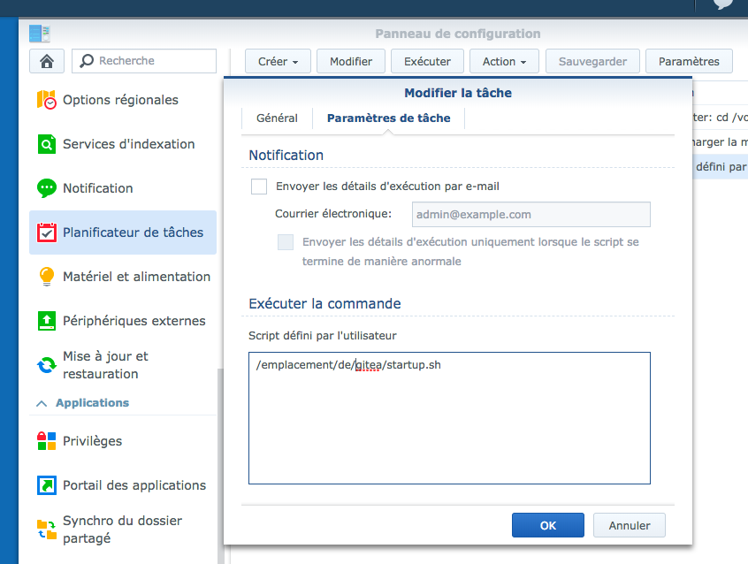

# Gitea Synology

Script de démarrage pour Gitea sur mon Nas Synology. Le paquet ne fonctionne pas correctement chez moi… J’ai donc pris la release classique, et j’execute une « tâche » planifé au démarrage de mon Synology.

Le script nécéssite tmux (disponible dans sur le repo [SynoCommunity](https://synocommunity.com/))
