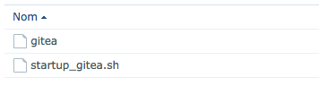
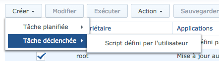

# Gitea Synology

Script de démarrage pour Gitea sur mon Nas Synology. Le paquet ne fonctionne pas correctement chez moi… J’ai donc fait un « petit script de démarrage » pour qu’il soit lancer au démarrage du système.

La structure doit être :




## Lancer Gitea au démarrage

⚠️ Éditer les 3 variables en haut du script

Pour l’installer copier le fichier ```startup_gitea.sh``` dans ```/usr/local/etc/rc.d/```:

```sh
cp startup_gitea.sh /usr/local/etc/rc.d/
chmod 755 /usr/local/etc/rc.d/startup_gitea.sh
```

## Méthode alternative

Si comme moi votre script de démarrage ne démarre pas automatiquement. Vous pouvez passer par « le planificateur de tâche » intégré au système :

⚠️ Le script doit être lancé en root.




