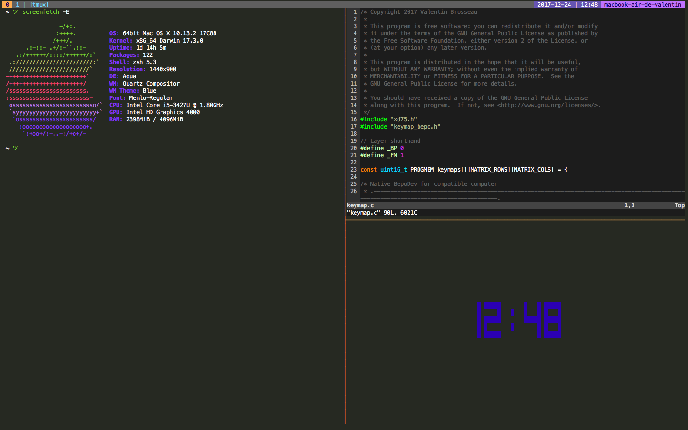

Tmux with tilling flavor.

## Alias

```sh
alias tmux="Dropbox/Linux/dotfiles/tmux/tools/manage.sh i"
```

## Shortcuts

| Raccourcis                 | Actions                  |
| --------------------------:| ------------------------:|
| ```Ctrl``` + ```Space```   | Prefix Mode              |
|              ```Space```   | choose-session           |
|              ```a```       | Reload Config            |
|              ```Enter```   | Split (current tree)     |
|              ```r```       | Rotate the tree          |
|              ```Up```      | Split window verticaly   |
|              ```Right```   | Split wimdow horizontaly |
|              ```Left```    | Sync pane                |

## Vidéo

[](https://www.youtube.com/watch?v=sZCFN9YKAlM)
