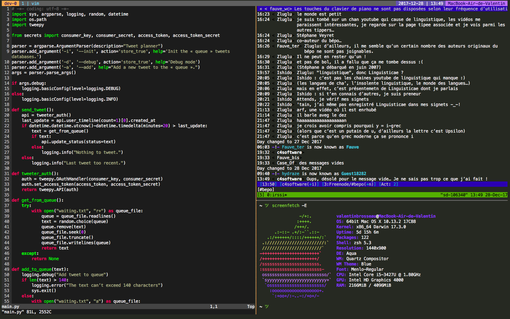

Tmux with tilling flavor.

## Alias

```sh
alias tmux="~/Dropbox/Linux/dotfiles/tmux/tools/manage.sh i"
```

## Shortcuts

| Raccourcis                 | Actions                  |
| --------------------------:| ------------------------:|
| ```Ctrl``` + ```Space```   | Prefix Mode              |
|              ```d```       | Detach                   |
|              ```Space```   | choose-session           |
|              ```a```       | Reload Config            |
|              ```Enter```   | Split (current tree)     |
|              ```r```       | Rotate the tree          |
|              ```Up```      | Split window verticaly   |
|              ```Right```   | Split wimdow horizontaly |
|              ```s```       | Sync pane                |
|              ```q```       | Close the current window |
|              ```w```       | Close the current pane   |
|              ```Tab```     | Next Window              |
| ```Shift``` + ```Up```     | resize-pane -U 15        |
| ```Shift``` + ```Down```   | resize-pane -D 15        |
| ```Shift``` + ```Left```   | resize-pane -L 25        |
| ```Shift``` + ```Right```  | resize-pane -R 25        |
| ```Alt```   + ```Enter```  | Split (current tree)     |
| ```Alt```   + ```Left```   | Swap the current pane    |
| ```Alt```   + ```Right```  | Swap the current pane    |

## Vidéo

[](https://www.youtube.com/watch?v=nCUb_wJllS8)
